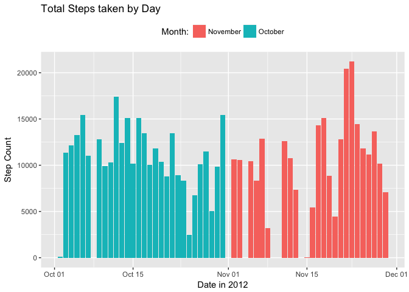

# Reproducible Research: Peer Assessment 1


## Loading and preprocessing data  
  
1. Load the data into the R object `activity` using `read.csv()`, specifying the classes of columns.
2. Transform the `date` column into date format for processing

```r
library(dplyr)
library(ggplot2)
activity <- read.csv(unzip("./activity.zip"), na.strings = "NA", colClasses = c("numeric","character","numeric"))
activity$date <- as.Date(activity$date, format = "%Y-%m-%d")
```

## What is the mean total number of steps per day

1. Calculate the total number of steps taken per day
2. Plot a histogram of number of steps taken per day (this will return a warning message due to the NA values of the dataset)


```r
totalstep <- aggregate(activity$steps, by = list(activity$date), sum)
names(totalstep) <- c("date","total.steps")
ggplot(totalstep)+
    geom_col(aes(date,total.steps,fill = months(date)))+
    theme(legend.position = "top")+
    scale_fill_discrete(name="Month:")+
    labs(title="Total Steps taken by Day", x="Date in 2012", y="Step Count")
```

```
## Warning: Removed 8 rows containing missing values (position_stack).
```

<!-- -->

3. Return the mean and median total steps per day


```r
mean(totalstep$total.steps, na.rm = T)
```

```
## [1] 10766.19
```

```r
median(totalstep$total.steps, na.rm = T)
```

```
## [1] 10765
```

## What is the average daily activity pattern?

1. Calculate average steps taken for each interval for all days
2. Plot time series


```r
meanstep <- aggregate(activity$steps, by = list(activity$interval), mean, na.rm = T)
names(meanstep) <- c("interval","average.steps")
with(meanstep, plot(interval, average.steps, type = "l", ylab="", xlab=""))
    title(main = "Average Steps per Interval", xlab = "Interval", ylab = "Average Steps")
```

<!-- -->

3. Find the interval with the maximum number of steps


```r
meanstep$interval[which.max(meanstep$average.steps)]
```

```
## [1] 835
```

## Imputing missing values

1. Report total number of NA values


```r
sum(is.na(activity$steps))
```

```
## [1] 2304
```

2. Impute average value for each interval into missing values


```r
merged <- merge(meanstep,activity)
for (i in 1:nrow(merged)) {
    if(is.na(merged$steps[i])){
        merged$steps[i] <- merged$average.steps[i]
    }
}
```

3. Plot new histogram of total steps taken per day


```r
imputestep <- aggregate(merged$steps, by = list(merged$date), sum)
names(imputestep) <- c("date","total.steps")
ggplot(imputestep)+
    geom_col(aes(date,total.steps,fill = months(date)))+
    theme(legend.position = "top")+
    scale_fill_discrete(name="Month:")+
    labs(title="Total Steps taken by Day (Imputed Data)", x="Date in 2012", y="Step Count")
```

<!-- -->

4. Return the new mean and median steps per day


```r
mean(imputestep$total.steps)
```

```
## [1] 10766.19
```

```r
median(imputestep$total.steps)
```

```
## [1] 10766.19
```

So we see that there is no change to the mean, but the median steps now equals the mean!

## Are there differences in activity patterns between weekdays and weekends?

1. Introduce new factor variable


```r
weekdays(activity$date) -> dayend
for(j in 1:length(dayend)){
    if(dayend[j] %in% c("Saturday", "Sunday")){
        dayend[j] <- "weekend"
    }
    else {
        dayend[j] <- "weekday"
    }
}
activity$dayend <- dayend
```

2. Compute average steps across weekday days and weekend days for each interval (this requires the `dplyr` package)
3. Plot time series panel plot


```r
activity %>% group_by(interval, dayend) %>% summarise(ave.steps = mean(steps, na.rm = T)) -> dayVSend
ggplot(dayVSend)+
    geom_line(aes(interval,ave.steps))+
    facet_grid(dayend~.)+
    labs(title="Average Steps per Interval on Weekday vs. Weekend", x="Interval", y="Average Steps per Interval")
```

<!-- -->
